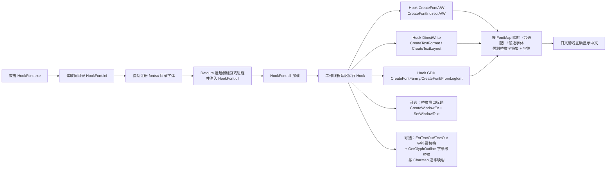

<p align="center">
  
</p>

# HookFont — 日系 Galgame 字体替换 / 汉化工具链

<div align="center">

[](LICENSE)


[](https://github.com/isTurn/HookFont-Test/releases)
[](https://github.com/isTurn/HookFont-Test/actions/workflows/build.yml)
[](https://isturn.github.io/HookFont-Test/)

一个用于**日系 Galgame（视觉小说）汉化与字体替换**的 Windows 工具链。

</div>

启动目标游戏进程，向其中注入 Hook DLL，强制把游戏创建的所有字体替换成指定字符集 + 字体，使日文游戏能正确显示中文。常用于配合机器翻译补丁 / 汉化补丁使用。

---

## ✨ 特性

- **强制字体替换**：Hook `CreateFontA/W`、`CreateFontIndirectA/W` 四个 GDI 字体创建 API，统一替换为配置的字符集（默认 `0x86` GB2312）+ 字体
- **字符集伪装（CharsetSpoof）**：对 Shift-JIS 引擎（AGE 等日系 galgame 引擎）只替换字体名、保留引擎请求的字符集，避免强制 GB2312 破坏引擎的文本解码（乱码）。开启后配合中日文兼容字体（微软雅黑 / MS Gothic）即可在不动编码的前提下换字体
- **字体度量调整**：`FontHeightScale` / `FontWidthScale`（百分比）、`FontWeight`（粗细）、`FontItalic`（倾斜）、`FontExtraScale`（字距）——替换字体后按需修正行距 / 字宽 / 粗细，解决文字错位、重叠、过细过粗
- **繁简自动映射（AutoSC）**：`AutoSC = true` 时 ExtTextOutW 文本自动把繁体字形映射为简体（如"東"→"东"），再应用 `[CharMap]`——繁体汉化版 / 日文汉字直接显示简体字形的场景
- **代码页重定向（CPRedirect）**：Shift-JIS 引擎（AGE 等）按自己请求的代码页（932）解析字节流，`CPRedirectCodePage = 936/65001` 让 `GetACP/GetOEMCP/GetCPInfo/MultiByteToWideChar` 改按 GBK/UTF-8 解码——"让日文引擎直接显示中文"的最后一环，可与 CharsetSpoof + AutoSC 组合
- **渲染质量（FontQuality）**：强制替换字体的 `lfQuality`（抗锯齿 4 / ClearType 5），解决替换后文字发虚、锯齿、过粗
- **字号缩放与下限**：`FontSizeScale`（百分比放大）、`MinFontSize`（|lfHeight| 下限），引擎默认字号偏小（AGE 系）时强制放大
- **行距缩放（LineHeightScale）**：缩放 GetTextMetrics 返回的 tmHeight/Ascent/Descent（引擎排版换行的依据），修正替换字体后行距过窄、文字重叠——与 FontHeightScale 不同，它改的是排版度量而非字体本身
- **DirectWrite 补全**：Hook `IDWriteFactory::CreateTextFormat`、`CreateTextLayout` / `CreateGdiCompatibleTextLayout` 及 `IDWriteTextLayout::SetFontFamilyName`，完整覆盖 WPF / Unity 等现代渲染引擎游戏（运行中改字体也生效）
- **GDI+ 支持**：Hook `GdipCreateFontFamilyFromName`、`GdipCreateFont`（family+size 一步建字体的缓存 family 场景）与 `GdipCreateFontFromLogfontA/W`，完整覆盖走 GDI+ 创建字体的老游戏 / 引擎
- **字体缺失检测**：启动时校验全局 `FontName` 与 `[FontMap]` 每个目标字体是否真的已安装，缺失在 `HookFont.log` 标 `[FontCheck]` 告警——"字体没换过来"一眼定位
- **字体自动安装**：把字体文件放进 DLL 同目录 `fonts\`（`*.ttf/*.ttc/*.otf`），启动时自动 `AddFontResource` 注册，无需手动安装、免管理员权限
- **字体映射表**：`[FontMap]` 段支持"原字体名 → 新字体名"替换，优先于全局替换；支持 `*` / `?` 通配符模糊匹配（精确匹配优先）
- **候选字体回退**：`FontName` 支持逗号分隔的候选列表，自动选用第一个系统已安装的字体
- **Detours 注入**：基于 Microsoft Detours 挂起创建目标进程并注入 DLL，稳定可靠
- **注入已运行进程**：`HookFont.exe -pid <PID>` 直接向已运行的进程注入（Steam / 官方启动器拉起游戏、需进主菜单后再挂补丁等场景）
- **命令行启动**：`HookFont.exe <game.exe> [参数...]` 直接指定要启动的游戏并透传启动参数，无需改 ini
- **x86 / x64 双平台**：32 位与 64 位游戏均可使用，仓库附带 Detours x86 + x64 静态库
- **窗口标题替换**：Hook `CreateWindowExA/W` + `SetWindowTextA/W`，创建窗口与运行时改标题都会被替换（宽字符安全）
- **字符级替换（ExtTextOut/TextOut）**：`[CharMap]` 段逐字符映射表，文本经 GDI `ExtTextOut`/`TextOut` 绘制前逐字替换——用于引擎锁定字体、个别字符变豆腐块时的兜底（如日文标点/假名按字形近似替换）
- **字形级替换（GetGlyphOutline）**：同一 `[CharMap]` 表作用于 `GetGlyphOutlineA/W` 字形查询——覆盖不渲染文本、直接抓取字形位图的老 DirectX 引擎（与 ExtTextOut 替换互补）
- **字体名伪装（FaceNameSpoof）**：`GetTextFaceA/W`、`GetObjectW`（LOGFONT 查询）返回引擎"请求的原始字体名"而非替换名——解决部分引擎创建字体后校验名字、发现被换就拒绝使用 / 反复重建的问题（与 CharsetSpoof 同为表面层伪装，不影响实际替换）
- **字体枚举伪装（EnumFontSpoof）**：引擎先用 `EnumFontFamiliesExW` 确认字体存在才创建时，对 `[FontMap]` 中精确命中的字体即使系统没装也伪造"存在"——解决"明明映射了却不换"（引擎因枚举不到就放弃）
- **DrawText 字符级替换**：`HookDrawText = true` 后 `[CharMap]` / `AutoSC` 同样作用于 `DrawTextA/W` 绘制的按钮、静态文本（部分引擎用 DrawText 而非 ExtTextOut）
- **多配置段**：`[HookFont:游戏.exe]` 覆盖段——一份 INI 管理多个游戏，该进程启动时用覆盖段键值顶替 `[HookFont]` 全局段（只覆盖写了的键）
- **热重载（HotReload）**：运行时每秒检查 INI 修改时间，变化自动重新加载（字体名 / [FontMap] / [CharMap] / 缩放 / 伪装等即时生效），调配置不用重启游戏；Hook 开关类改动仍需重启
- **诊断模式（-diag / Diagnostic=true）**：只记录不替换——每次字体创建请求（字体名 / 字符集 / 字号 / 质量）与文本绘制写进日志，定位"为什么字体没换过来"；排查完关闭
- **文本子串替换（[TextMap]）**：与逐字符的 `[CharMap]` 互补，整段子串替换（多字符对多字符），最长匹配不递归——把固定词组 / 错误译名整段改掉
- **控件文本替换（HookSetWindowText）**：`SetWindowTextA/W` 设置的按钮、对话框、状态栏文本也走 `[TextMap]` / `[CharMap]` / `AutoSC`，与窗口标题替换互不冲突
- **INI 编码自动识别**：UTF-8（含 BOM）、UTF-16（记事本"Unicode"）、ANSI/GBK 都能正确解析，存成哪种编码都不怕
- **字体清单（-listfonts）**：`HookFont.exe -listfonts` 把系统全部可用字体名写到 `fonts_list.txt`，选字体照着填
- **日志滚动 + 键名告警**：日志超 2MB 自动滚动成 `.old`；INI 里写错 / 不认的键会在日志打 `[Config] WARNING: unknown key ...`，不静默失效
- **SelectObject 兜底**：引擎从资源直接加载字体、绕过 `CreateFont` 时，只要把字体选进 DC 就一并替换（`HookSelectObject = true`）
- **未替换字体统计**：退出时日志打 `[FontStats]`，列出引擎请求过的每个字体及是否命中替换——一眼看清还有谁没被覆盖
- **DPI 感知 + 模块白名单**：`DpiScaleAuto` 高 DPI 屏自动微调字号；`HookMainModuleOnly` 只换游戏主模块字体，系统/输入法/叠加层不动
- **免配置环境**：配置按程序自身目录解析，不依赖当前工作目录；中文路径自动转 8.3 短路径
- **延迟 Hook**：从工作线程延迟执行 Hook，规避加载器锁死锁风险
- **日志排查**：运行日志落盘（`HookFont.log`），异常可追查，不弹窗卡游戏

## 🗂 组成

```
HookFont.sln
├── src
│   ├── HookFont            HookFont.dll（注入用 Hook 插件）
│   │   └── dllmain.cpp     入口：延迟到工作线程执行 Hook
│   └── RiaLoader           RiaLoader.exe（启动器，成品改名为 HookFont.exe）
│       └── RiaLoader.cpp   用 Microsoft Detours 创建游戏进程并注入 DLL
├── lib
│   └── Rxx                 个人工具库（静态库）
│       ├── Hook*           Detours 封装 + 字体/窗口 Hook 实现
│       ├── INI*            UTF-8 INI 解析（Rcf::INI）
│       ├── File*/Str*/Mem* 路径 / 字符串 / 内存工具
│       └── Console*        控制台工具
├── assets                  README 封面等静态资源
└── third
    └── detours             Microsoft Detours（x86 + x64 头文件与库）
```

## 🔄 工作原理



## 🚀 使用（部署给玩家）

把以下 3 个文件复制到游戏目录，编辑 `HookFont.ini` 后双击 `HookFont.exe`：

| 文件 | 说明 |
|---|---|
| `HookFont.dll` | 注入用 Hook 插件 |
| `HookFont.exe` | 启动器（RiaLoader 改名） |
| `HookFont.ini` | 配置文件（UTF-8 编码） |

`HookFont.ini` 示例：

```ini
[RiaLoader]
TargetEXE = ojyousama.exe
TargetDLLCount = 2
TargetDLLName_0 = HookFont.dll
TargetDLLName_1 = kDays.dll

[HookFont]
Charset = 0x86
FontName = 黑体, 微软雅黑, 宋体
; 字符集伪装：对 Shift-JIS 引擎（AGE 等）只换字体名、保留引擎字符集。
; 开启时 Charset 不生效，请把 FontName 换成中日文兼容字体（微软雅黑 / MS Gothic）。
CharsetSpoof = false
; 字体度量调整（只作用于被替换的字体，100 = 不缩放；FontWeight 0 = 保持原值）
FontHeightScale = 100
FontWidthScale = 100
FontWeight = 0
FontItalic = -1
FontExtraScale = 100        ; 字距百分比（SetTextCharacterExtra，非 100 自动 Hook）
FontQuality = 0             ; 渲染质量：0 不干预 / 4 抗锯齿 / 5 ClearType（替换字体发虚时用）
FontSizeScale = 100         ; 字号百分比放大（|lfHeight|）
MinFontSize = 0             ; 字号下限（|lfHeight| 不得小于，0 = 关闭）
LineHeightScale = 100       ; 行距百分比（GetTextMetrics 返回的 tmHeight，修正文字重叠）
CPRedirectFrom = 932        ; 代码页重定向：引擎认定的代码页（Shift-JIS）
CPRedirectCodePage = 0      ; 重定向到：0 关 / 936 GBK / 65001 UTF-8（配合 CharsetSpoof 用）
HookCreateFontA = true
HookCreateFontIndirectA = true
HookCreateFontW = true
HookCreateFontIndirectW = true
HookDirectWrite = true
HookGdiplus = true            ; GDI+ 引擎（CreateFontFamily/FromLogfont 全补全）
AutoInstallFonts = true
HookWindowTitle = false
HookTextOut = false        ; 字符级替换开关（配合下方 [CharMap]）
HookGlyphOutline = false   ; 字形级替换开关（同样走 [CharMap]，老 DirectX 引擎兜底）
AutoSC = false             ; 繁简自动映射（ExtTextOutW 文本先繁→简再应用 [CharMap]）
HookDrawText = false       ; DrawTextA/W 也走 [CharMap]/AutoSC（按钮/静态文本场景）
HookSetWindowText = false  ; SetWindowTextA/W 也走 [TextMap]/[CharMap]/AutoSC（控件文本）
FaceNameSpoof = false      ; 字体名伪装：GetTextFace/GetObject 返回引擎请求的原始名字
EnumFontSpoof = false      ; 枚举伪装：[FontMap] 精确命中的字体即使没装也向引擎伪造"存在"
Diagnostic = false         ; 诊断模式：只记录不替换（也可用启动器 -diag 开启）
HotReload = false          ; 热重载：INI 变化自动重新加载（Hook 开关类改动需重启）

; 多配置段（可选）：[HookFont:游戏.exe] 覆盖 [HookFont] 全局段，一份 INI 管多个游戏
; [HookFont:oyjyousama.exe]
; FontName = 宋体

[FontMap]
MS Gothic = 黑体
MS* = 黑体        ; 通配符：所有 MS 开头的字体都换成黑体

[CharMap]
「 = “            ; 日文全角左引号 → 中文左引号（逐字符替换，用于 ExtTextOut/TextOut 文本）
」 = ”
あ = 阿           ; 字形近似的假名 → 汉字

; [TextMap] 子串替换（可选，多字符对多字符，最长匹配，不递归）
; [TextMap]
; あいう = 阿衣乌
```

> 详细部署与排查说明见 [USAGE.txt](USAGE.txt)。

**命令行用法**（可选，默认双击启动器即可）：

```
HookFont.exe <游戏exe路径> [游戏参数...]   # 直接启动指定游戏并透传参数
HookFont.exe -pid <进程ID>                # 注入到已运行的进程（位数需匹配）
HookFont.exe -diag                        # 诊断模式：只记录字体请求不替换（等价 ini Diagnostic=true）
```

**约定与注意**

- 所有 INI 文件**编码必须是 UTF-8**；`xxx.ini` 必须与 `xxx.dll` / `xxx.exe` 同名
- 配置文件按**程序自身所在目录**解析，不依赖“当前工作目录”，从任意位置双击运行均可
- 启动器以**游戏所在目录**作为目标进程的工作目录，保证游戏相对路径读取正常
- 游戏目录含中文等非 ASCII 路径时，注入 DLL 会自动转换为短路径（8.3）以兼容 Detours 的 ANSI 接口
- 运行后生成 `HookFont.log`（DLL 侧）与 `HookFont.exe` 同名的 `.log`（启动器侧），异常时优先查看日志

## 🔧 构建

环境：**Visual Studio 2022**（v143 工具集，MSVC）。用 VS 打开 `HookFont.sln`，选 **Release | x86** 或 **Release | x64** 生成即可。产出分别在 `Release\`（x86）与 `x64\Release\`（x64）：

- `HookFont.dll`
- `RiaLoader.exe`（部署时改名为 `HookFont.exe`）
- `Rxx.lib`

命令行构建：

```
MSBuild.exe HookFont.sln /t:Rebuild /p:Configuration=Release /p:Platform=x86
MSBuild.exe HookFont.sln /t:Rebuild /p:Configuration=Release /p:Platform=x64
```

仓库已配置 [GitHub Actions 自动构建](.github/workflows/build.yml)（`windows-latest` + MSBuild），每次 push 到 `main` 会自动编译 **x86 / x64 双版本**并在 Artifacts 中产出。

### x86 / x64 说明

仓库附带 Microsoft Detours **x86 与 x64 双平台静态库**（`third\detours\lib.X86` / `lib.X64`），两种位数开箱即用。按游戏位数选择对应版本：32 位游戏用 x86，64 位游戏用 x64。

## 📦 与旧版（改进前）的差异

- 修复编译错误：废弃的 `std::locale::empty()`、`File.h` 误引用 `String.h`
- 修复逻辑 Bug：Detours 封装返回值反转；INI 无符号整数固定按 16 进制解析；内存搜索失败即 `ExitProcess` 杀进程；ANSI 路径函数对多字节字符的截断判断
- 配置 / 目标路径改为基于程序自身目录解析，不再受“当前工作目录”影响
- Hook 从 `DllMain` 内直接执行改为**工作线程延迟执行**，避免加载器锁死锁风险，并调用 `DisableThreadLibraryCalls`
- 新增 `CreateFontW` / `CreateFontIndirectW` 两个 Unicode 版 Hook；接通原本已实现但未接线的窗口标题替换 `HookTitleExA`
- 新增 **DirectWrite 引擎支持**（`IDWriteFactory::CreateTextFormat` vtable Hook，无 dwrite.lib 依赖），覆盖 WPF/Unity 等现代引擎游戏
- 新增 **DirectWrite 补全**：`CreateTextLayout` / `CreateGdiCompatibleTextLayout` 与 `IDWriteTextLayout::SetFontFamilyName`（运行时改字体也替换）
- 新增 **GDI+ 支持**：Hook `GdipCreateFontFamilyFromName`（后续补全 `GdipCreateFont` 与 `GdipCreateFontFromLogfontA/W`）
- 新增 **字体缺失检测**：启动时校验目标字体是否已安装，缺失日志标 `[FontCheck]` 告警
- 新增 **字体自动安装**：DLL 同目录 `fonts\` 子目录字体自动 `AddFontResource` 注册
- 新增 **`[FontMap]` 字体映射表**：按"原字体名 → 新字体名"替换，优先于全局替换；支持 `*` / `?` 通配模糊匹配（保序、精确优先）
- 新增 **候选字体回退**：`FontName` 支持逗号分隔列表，自动选用第一个已安装字体
- 窗口标题替换升级为 **`CreateWindowExA/W` + `SetWindowTextA/W` 四 API 宽字符 Hook**，运行中改标题也生效
- 新增 **`[CharMap]` 字符级替换**（ExtTextOut/TextOut）：逐字符映射表，Hook `ExtTextOutW/A`（TextOut 内部经 ExtTextOut 覆盖），用于引擎锁定字体、字符变豆腐块时的兜底
- 新增 **字形级替换**（GetGlyphOutlineA/W）：同一 `[CharMap]` 表作用于字形查询，覆盖直接抓取字形位图的老 DirectX 引擎
- 新增 **注入已运行进程**（`-pid`）与**命令行启动 / 参数透传**
- 新增 **x64 支持**：附带 Detours x64 静态库，`Release | x64` 开箱即用
- 注入 DLL 内的失败提示由弹窗改为**日志文件**，避免弹窗卡死游戏
- 启动器自动把游戏目录设为目标进程工作目录；中文路径自动转短路径注入
- 编译告警清零（`/W3` 下无 warning），x64 类型安全

## 📄 License

[MIT](LICENSE) © isTurn

---

*字体替换依赖 [Microsoft Detours](https://github.com/microsoft/Detours)（MIT），随仓库附带 x86 与 x64 版。*
