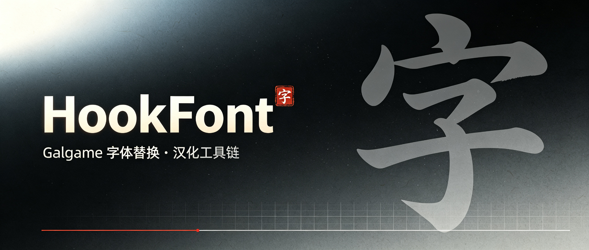
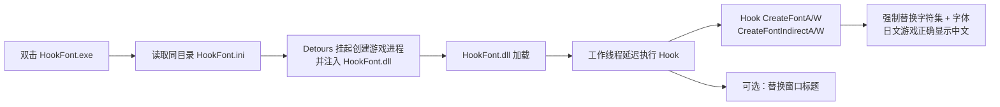

<p align="center">
  
</p>

# HookFont — 日系 Galgame 字体替换 / 汉化工具链

<div align="center">

[](LICENSE)


[](https://github.com/isTurn/HookFont-Test/releases)
[](https://github.com/isTurn/HookFont-Test/actions/workflows/build.yml)

一个用于**日系 Galgame（视觉小说）汉化与字体替换**的 Windows 工具链。

</div>

启动目标游戏进程，向其中注入 Hook DLL，强制把游戏创建的所有字体替换成指定字符集 + 字体，使日文游戏能正确显示中文。常用于配合机器翻译补丁 / 汉化补丁使用。

---

## ✨ 特性

- **强制字体替换**：Hook `CreateFontA/W`、`CreateFontIndirectA/W` 四个字体创建 API，统一替换为配置的字符集（默认 `0x86` GB2312）+ 字体（默认黑体）
- **Detours 注入**：基于 Microsoft Detours 挂起创建目标进程并注入 DLL，稳定可靠
- **窗口标题替换**：可选将游戏窗口标题替换为任意文本
- **免配置环境**：配置按程序自身目录解析，不依赖当前工作目录；中文路径自动转 8.3 短路径
- **延迟 Hook**：从工作线程延迟执行 Hook，规避加载器锁死锁风险
- **日志排查**：运行日志落盘（`HookFont.log`），异常可追查，不弹窗卡游戏

## 🗂 组成

```
HookFont.sln
├── src
│   ├── HookFont            HookFont.dll（注入用 Hook 插件）
│   │   └── dllmain.cpp     入口：延迟到工作线程执行 Hook
│   └── RiaLoader           RiaLoader.exe（启动器，成品改名为 HookFont.exe）
│       └── RiaLoader.cpp   用 Microsoft Detours 创建游戏进程并注入 DLL
├── lib
│   └── Rxx                 个人工具库（静态库）
│       ├── Hook*           Detours 封装 + 字体/窗口 Hook 实现
│       ├── INI*            UTF-8 INI 解析（Rcf::INI）
│       ├── File*/Str*/Mem* 路径 / 字符串 / 内存工具
│       └── Console*        控制台工具
├── assets                  README 封面等静态资源
└── third
    └── detours             Microsoft Detours（x86 版头文件 + 库）
```

## 🔄 工作原理



## 🚀 使用（部署给玩家）

把以下 3 个文件复制到游戏目录，编辑 `HookFont.ini` 后双击 `HookFont.exe`：

| 文件 | 说明 |
|---|---|
| `HookFont.dll` | 注入用 Hook 插件 |
| `HookFont.exe` | 启动器（RiaLoader 改名） |
| `HookFont.ini` | 配置文件（UTF-8 编码） |

`HookFont.ini` 示例：

```ini
[RiaLoader]
TargetEXE = ojyousama.exe
TargetDLLCount = 2
TargetDLLName_0 = HookFont.dll
TargetDLLName_1 = kDays.dll

[HookFont]
Charset = 0x86
FontName = 黑体
HookCreateFontA = true
HookCreateFontIndirectA = true
HookCreateFontW = true
HookCreateFontIndirectW = true
HookWindowTitle = false
```

> 详细部署与排查说明见 [USAGE.txt](USAGE.txt)。

**约定与注意**

- 所有 INI 文件**编码必须是 UTF-8**；`xxx.ini` 必须与 `xxx.dll` / `xxx.exe` 同名
- 配置文件按**程序自身所在目录**解析，不依赖“当前工作目录”，从任意位置双击运行均可
- 启动器以**游戏所在目录**作为目标进程的工作目录，保证游戏相对路径读取正常
- 游戏目录含中文等非 ASCII 路径时，注入 DLL 会自动转换为短路径（8.3）以兼容 Detours 的 ANSI 接口
- 运行后生成 `HookFont.log`（DLL 侧）与 `HookFont.exe` 同名的 `.log`（启动器侧），异常时优先查看日志

## 🔧 构建

环境：**Visual Studio 2022**（v143 工具集，MSVC）。用 VS 打开 `HookFont.sln`，选 **Release | x86** 生成即可，产出在 `Release\`：

- `HookFont.dll`
- `RiaLoader.exe`（部署时改名为 `HookFont.exe`）
- `Rxx.lib`

命令行构建：

```
MSBuild.exe HookFont.sln /t:Rebuild /p:Configuration=Release /p:Platform=x86
```

仓库已配置 [GitHub Actions 自动构建](.github/workflows/build.yml)（`windows-latest` + MSBuild），每次 push 到 `main` 会自动编译并在 Artifacts 中产出上述文件。

### x64 说明

代码已按 64 位安全类型（`HMODULE` / `uintptr_t`）改造，`RiaLoader` / `HookFont.dll` 使用 Detours 的部分可移植到 x64。但仓库内只附带了 **x86 版 detours 库**，要生成 x64 需要自行获取 Microsoft Detours 的 x64 静态库，放到：

```
third\detours\lib.X64\detours.lib
```

x86 专属的手动内联 Hook 助手（`WriteHookCode` / `SetHook` 等，基于 E9 rel32）在 x64 下会返回失败（保留接口但不生效），实际路径已全部走 Detours。

## 📦 与旧版（改进前）的差异

- 修复编译错误：废弃的 `std::locale::empty()`、`File.h` 误引用 `String.h`
- 修复逻辑 Bug：Detours 封装返回值反转；INI 无符号整数固定按 16 进制解析；内存搜索失败即 `ExitProcess` 杀进程；ANSI 路径函数对多字节字符的截断判断
- 配置 / 目标路径改为基于程序自身目录解析，不再受“当前工作目录”影响
- Hook 从 `DllMain` 内直接执行改为**工作线程延迟执行**，避免加载器锁死锁风险，并调用 `DisableThreadLibraryCalls`
- 新增 `CreateFontW` / `CreateFontIndirectW` 两个 Unicode 版 Hook；接通原本已实现但未接线的窗口标题替换 `HookTitleExA`
- 注入 DLL 内的失败提示由弹窗改为**日志文件**，避免弹窗卡死游戏
- 启动器自动把游戏目录设为目标进程工作目录；中文路径自动转短路径注入
- 编译告警清零（`/W3` 下无 warning），x64 类型安全

## 📄 License

[MIT](LICENSE) © isTurn

---

*字体替换依赖 [Microsoft Detours](https://github.com/microsoft/Detours)（MIT），随仓库附带 x86 版。*
